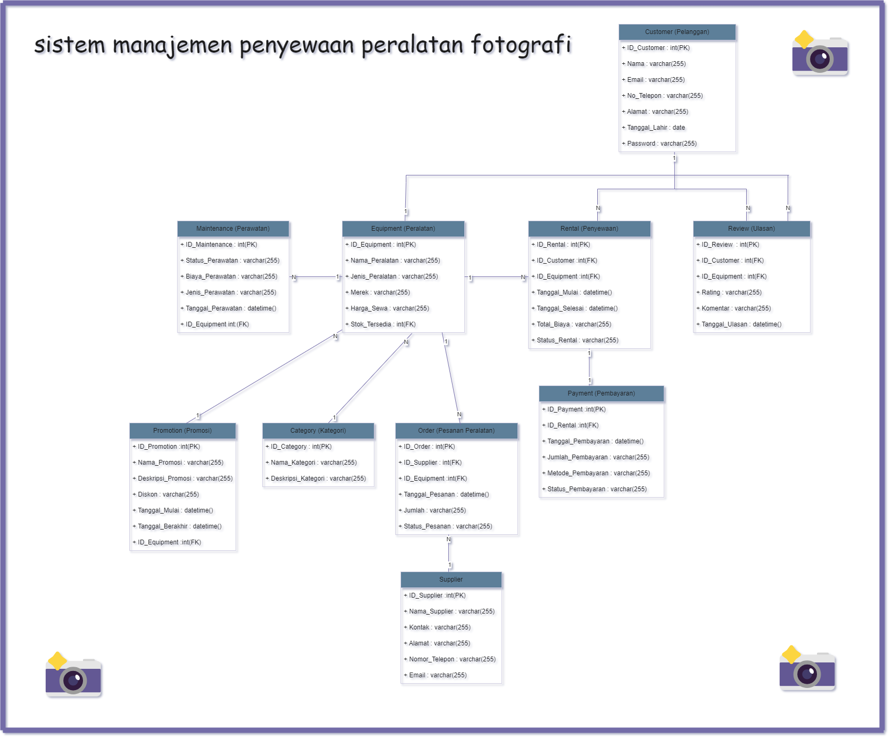
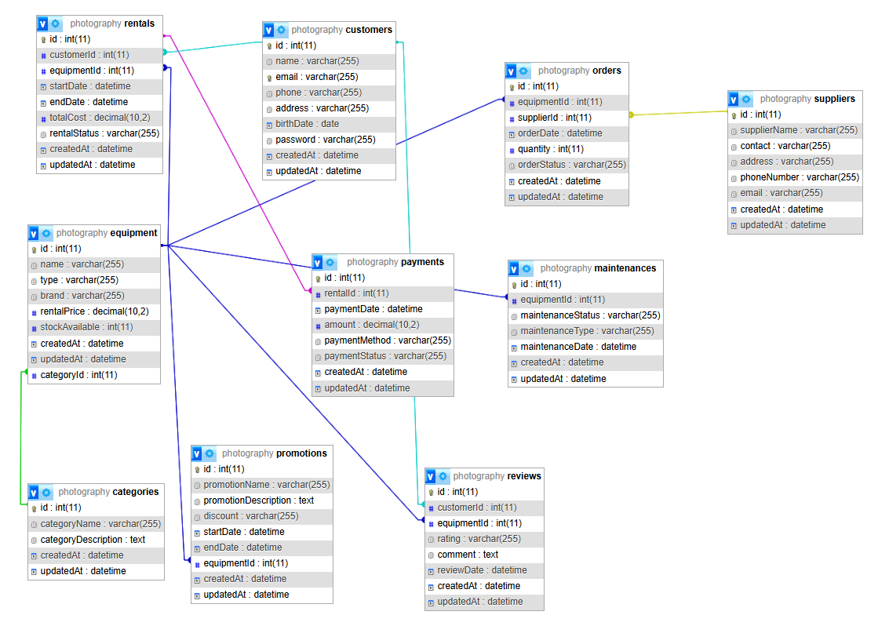
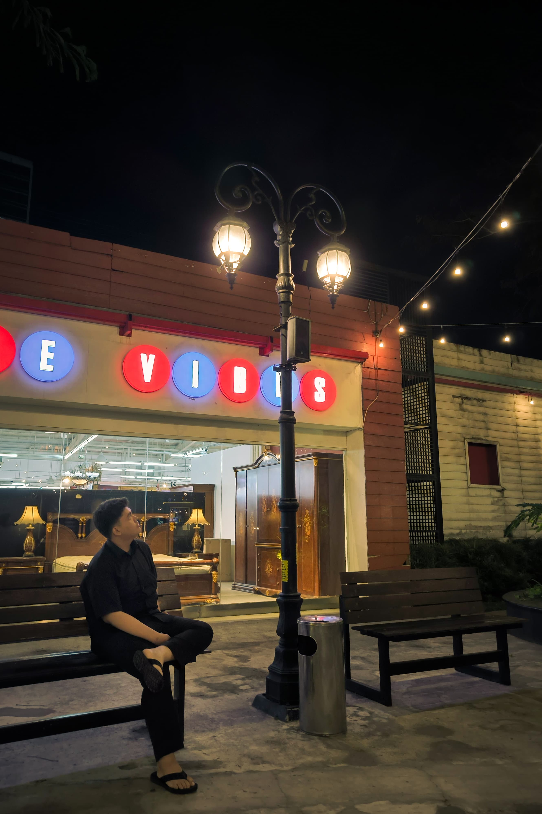

# CASE PROJECT : sistem manajemen penyewaan peralatan photography 📸📸

Deskripsi:  Sistem ini memungkinkan pengguna untuk menyewa berbagai jenis peralatan fotografi, seperti kamera, lensa, dan tripod. Pengguna dapat melihat stok peralatan yang tersedia, melakukan pemesanan, dan mengatur pengembalian barang. Pemilik sistem dapat mengelola inventaris, pemesanan, dan perawatan peralatan.

# DESKRIPSI CASE 🤳

Dalam project ini terdapat beberapa entitas utama yang berhubungan satu sama lain:

## Hubungan Antar Tabel:
### 1. Customer (Pelanggan): Pengguna yang menyewa peralatan fotografi.
### 2. Equipment (Peralatan): Barang fotografi yang dapat disewa, seperti kamera, lensa, tripod.
### 3. Category (Kategori): Kategori atau jenis peralatan fotografi, misalnya DSLR, Mirrorless, Aksesoris.
### 4. Rental (Penyewaan): Proses penyewaan peralatan oleh pelanggan, termasuk periode sewa dan biaya.
### 5. Payment (Pembayaran): Pembayaran yang dilakukan pelanggan setelah menyewa peralatan.
### 6. Review (Ulasan): Ulasan dan penilaian yang diberikan pelanggan untuk peralatan yang telah mereka sewa.
### 7. Maintenance (Perawatan): Aktivitas perawatan atau perbaikan peralatan setelah disewa.
### 8. Supplier (Pemasok): Pihak yang menyuplai peralatan fotografi kepada sistem penyewaan.
### 9. Order (Pesanan Peralatan): Pesanan peralatan yang dilakukan ke pemasok untuk menambah stok.
### 10. Promotion (Promosi): Diskon atau penawaran yang berlaku untuk peralatan tertentu.

# RELASI ANTAR ENTITAS ✍️

## 1. Customer ke Rental (Penyewaan):
Setiap pelanggan dapat melakukan satu atau lebih penyewaan. <br>
Relasi: One-to-Many

## 2. Customer ke Review (Ulasan):
Setiap pelanggan dapat memberikan satu atau lebih ulasan terkait peralatan yang disewa. <br>
Relasi: One-to-Many

## 3. Equipment ke Rental (Penyewaan):
Setiap peralatan dapat disewa berkali-kali oleh pelanggan yang berbeda. <br>
Relasi: One-to-Many

## 4. Equipment ke Review (Ulasan):
Setiap peralatan bisa mendapatkan ulasan dari pelanggan yang menyewanya. <br>
Relasi: One-to-Many

## 5. Equipment ke Maintenance (Perawatan):
Setiap peralatan dapat menjalani satu atau lebih perawatan. <br>
Relasi: One-to-Many

## 6. Category ke Equipment (Peralatan):
Setiap kategori dapat mencakup banyak peralatan. <br>
Relasi: One-to-Many

## 7. Rental ke Payment (Pembayaran):
Setiap penyewaan memiliki satu pembayaran yang terkait. <br>
Relasi: One-to-One

## 8. Supplier ke Order (Pesanan Peralatan): <br>
Setiap pemasok dapat menerima satu atau lebih pesanan peralatan.
Relasi: One-to-Many

## 9. Order ke Equipment (Peralatan): <br>
Setiap pesanan bisa mencakup satu atau lebih peralatan yang dipesan dari pemasok.
Relasi: One-to-Many

## Dependecies / Teknologi yang digunakan 💻

1. **npm init -y**

    Perintah ini digunakan untuk secara otomatis menginisialisasi dan membuat file `package.json`

    ```bash
    npm init -y
    ```

2. **express**

    Express JS sebagai framework Node.js untuk mengelola request dan response HTTP

    ```bash
   npm i express
    ```

3. **mysql**

    package untuk melakukan koneksi ke database

    ```bash
    npm i mysql2
    ```

4. **dotenv**

    Dotenv untuk mengatur variabel lingkungan
    ```bash
    npm i dotenv
    ```

5. **sequelize**

    Sebagai Orm yang dipakai

    ```bash
    npm i sequelize
    ```


6. **nodemon**

    jalankan dengan mengetikan perintah (nodemon namaFile)

    ```bash
    npm install nodemon
    ```

    Perintah ini akan menjalankan server secara terus menerus

    Aplikasi akan berjalan pada port yang ditentukan di file `.env` .


<br>
    

# CLASS DIAGRAM 

 

<br>

# RELASI TABLE


<br>

# COPYRIGHT BY 🐣🐣
```
Nama : Israruddin ...
Kelas : XII PPLG .. 
Mapel : Produktif PPLG ...
Tugas : Sequelize (DATABASE ONLY) ...
```



